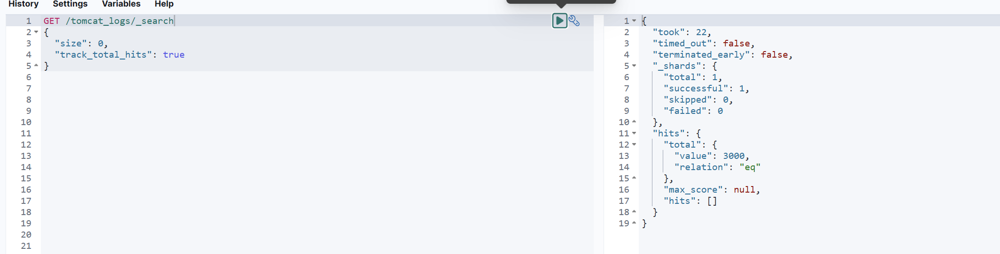
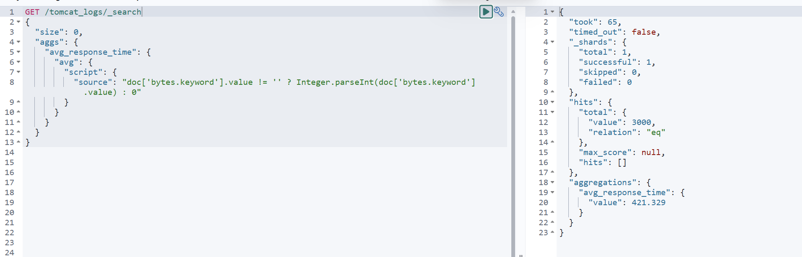
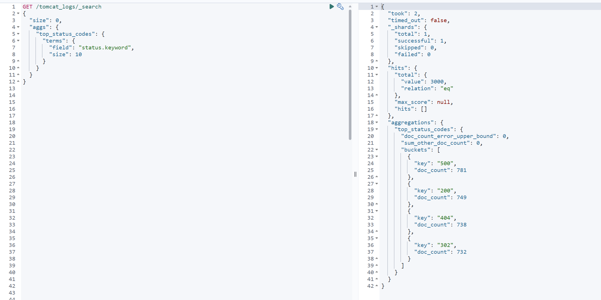
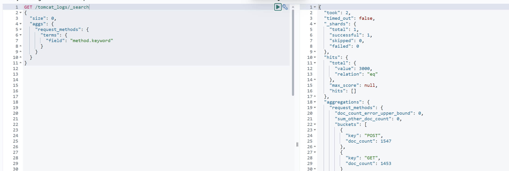
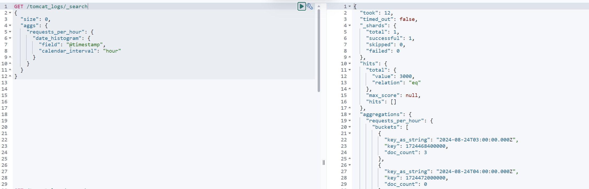
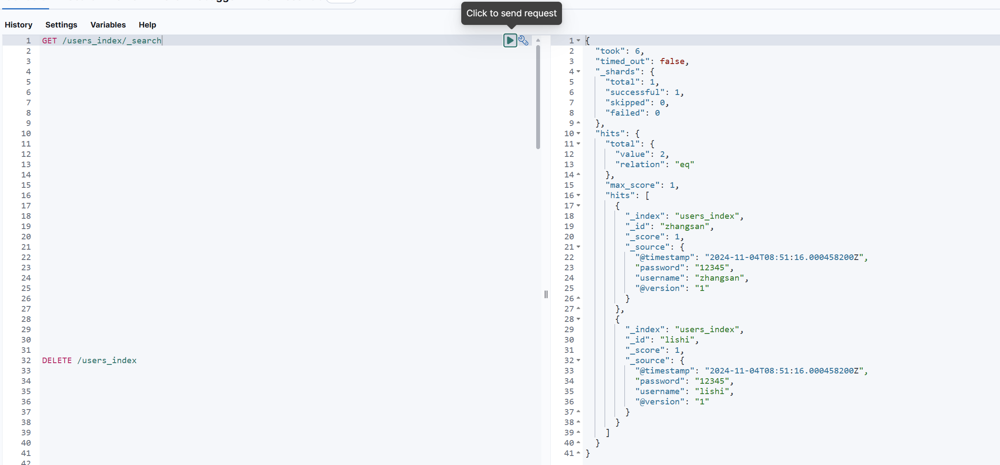
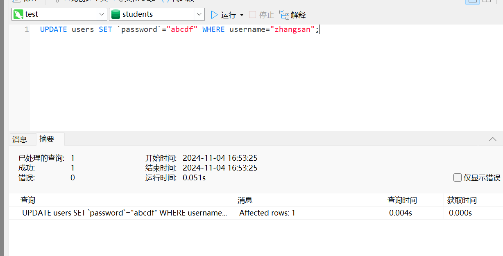
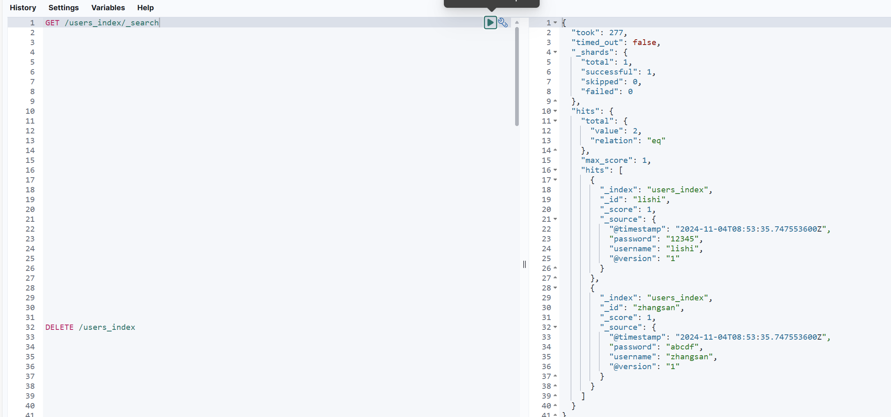

# 实验四：logstash操作
>**学院**：省级示范性学院    
>**课程**：高级数据库技术与应用
>**题目**：《实验四：聚合操作练习》  
>**姓名**：黄东鑫    
>**学号**:2200770045    
>**班级**:软工2201  
>**日期**:2024年11月4  
>**实验环境**:Elasticsearch8.12.2 Kibana8.12.2

## 1、实验目的
 logstash操作练习

## 2、实验内容
### 2.1 tomcat日志处理
要求：
1. 将tomcat的logs中的localhost_access_log访问日志导入到本地的elasticsearch中。
2. 数据导入到一个名为tomcat_logs的索引。
3. 在elasticsearch中做5个日志相关的分析，题目自拟。（提示：可以参考第04章聚合操作日志实战内容）
#### 2.1.1数据导入
```
input {
    file {
        path => "E:/testData/tomcat_logs/localhost_access_log.*.txt"
        start_position => "beginning"
        sincedb_path => "NUL"  # 每次启动 Logstash 从头开始读取文件
        codec => plain {
            charset => "UTF-8"
        }
        discover_interval => 10  # 每隔10秒检查新文件
    }
}

filter {
    grok {
        # 匹配Apache/Tomcat的access日志格式
        match => { "message" => "%{IPORHOST:client_ip} - - \[%{HTTPDATE:timestamp}\] \"%{WORD:method} %{DATA:request} HTTP/%{NUMBER:http_version}\" %{NUMBER:status} %{NUMBER:bytes}" }
    }

    # 将时间字符串转换为Logstash的@timestamp格式
    date {
        match => ["timestamp", "dd/MMM/yyyy:HH:mm:ss Z"]
        target => "@timestamp"
    }

    # 可以在此添加其他字段转换或条件逻辑
}

output {
    elasticsearch {
        hosts => ["http://localhost:9200"]
        index => "tomcat_logs"  # 导入到指定索引
    }
    stdout {
        codec => rubydebug  # 控制台输出用于调试
    }
}

```
#### 2.1.2日志分析
##### 2.1.2.1 查询总请求数


##### 2.1.2.2 查询平均响应时间


##### 2.1.2.3 查询前 10 个最常见的状态码


##### 2.1.2.4 查询每种请求方法的请求次数分布


##### 2.1.2.5 查询每小时的请求数分布


### 2.2 数据转换和传输
要求：
1. 将本地的mysql数据库中的一张表导入到本地的elasticsearch中。
2. 数据库表更新后，数据能够自动同步到elasticsearch中。

#### 2.2.1 logstash代码
```
input {
  jdbc {
    jdbc_driver_library => "D:/DownloadFromDing/mysql-connector-java-8.0.25.jar"
    jdbc_driver_class => "com.mysql.cj.jdbc.Driver"
    jdbc_connection_string => "jdbc:mysql://localhost:3306/students"
    jdbc_user => "jinx"
    jdbc_password => "111111"
    statement => "SELECT * FROM users"
    schedule => "*/5 * * * * *" # 每5秒运行一次
  }
}

output {
  elasticsearch {
    hosts => ["http://localhost:9200"]
    index => "users_index"
    document_id => "%{username}" # 假设 student 表有一个 id 字段作为主键
  }
  stdout { codec => json_lines }
}

```
#### 2.2.2 结果
更新前

更新后


## 3、问题及解决方法
* 问题  
    暂无
* 解决方法  