# 实验二：索引操作与操作文档的练习
>**学院**：省级示范性学院    
>**课程**：高级数据库技术与应用
>**题目**：《实验三：聚合操作练习》  
>**姓名**：黄东鑫    
>**学号**:2200770045    
>**班级**:软工2201  
>**日期**:2024年9月23  
>**实验环境**:Elasticsearch8.12.2 Kibana8.12.2

## 1、实验目的
 Elasticsearch 聚合操作练习

## 2、实验内容
### 2.1 统计每个产品类别的总销售额。
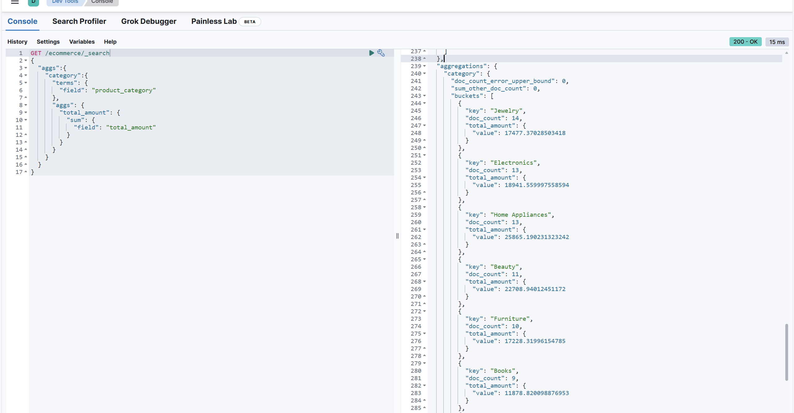

### 2.2计算每个城市的平均订单金额。
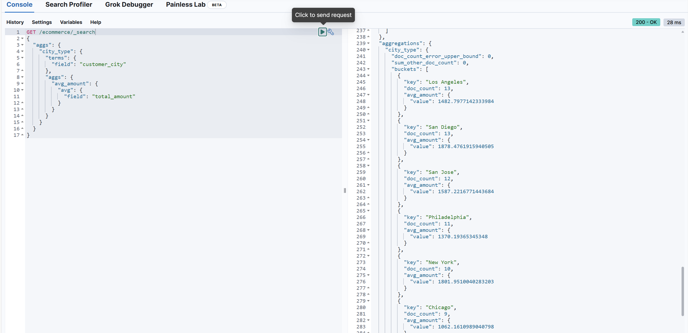
### 2.3 找出销量最高的前5个产品。
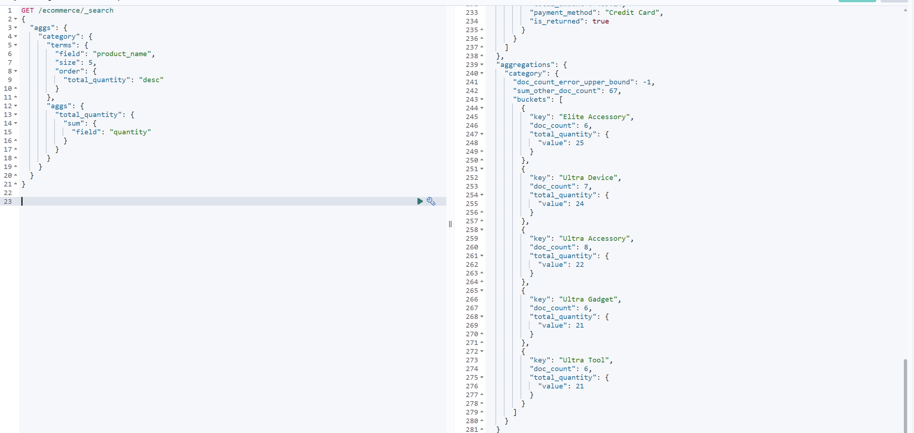
### 2.4计算男性和女性客户的平均年龄。
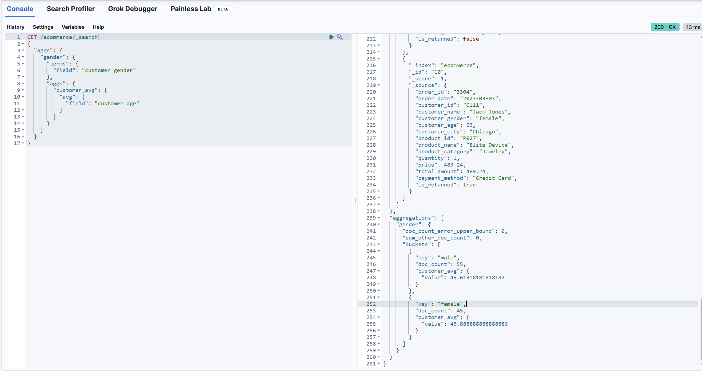
### 2.5统计每种支付方式的使用次数和总金额。
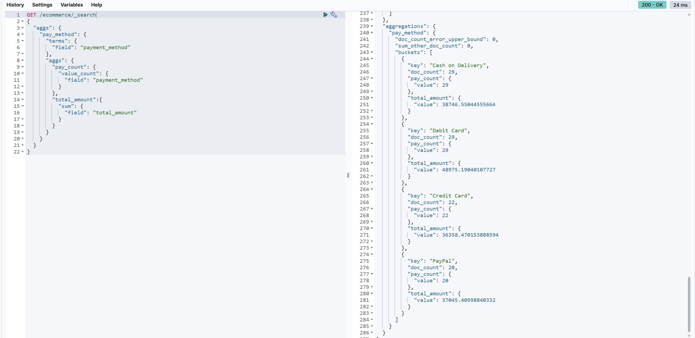
### 2.6计算每月的总销售额。
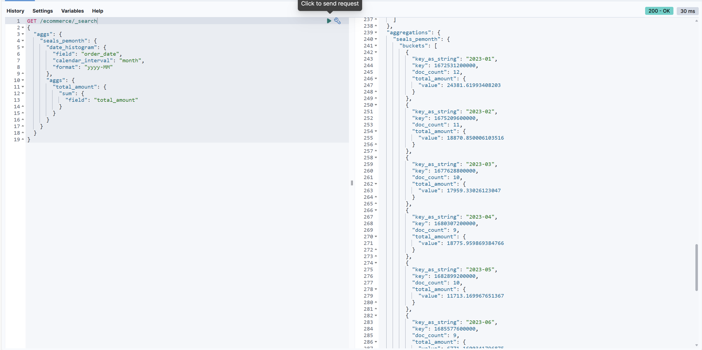
### 2.7找出平均订单金额最高的前3个客户。
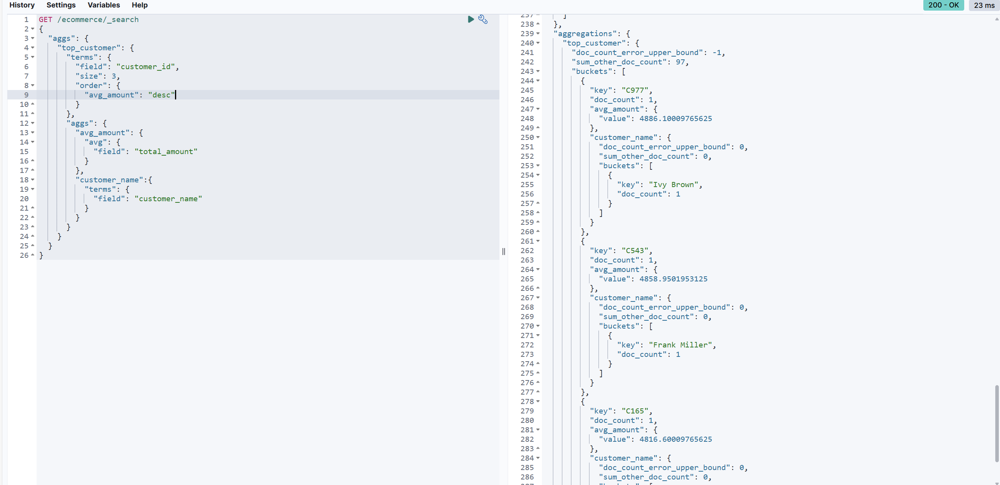
### 2.8计算每个年龄段(18-30,31-50,51+)的客户数量。
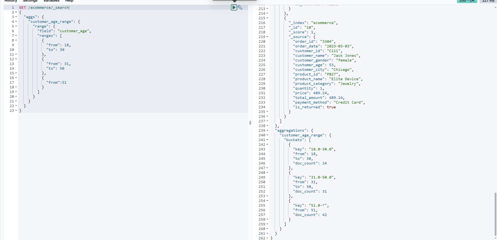
### 2.9计算每个产品类别的平均单价。
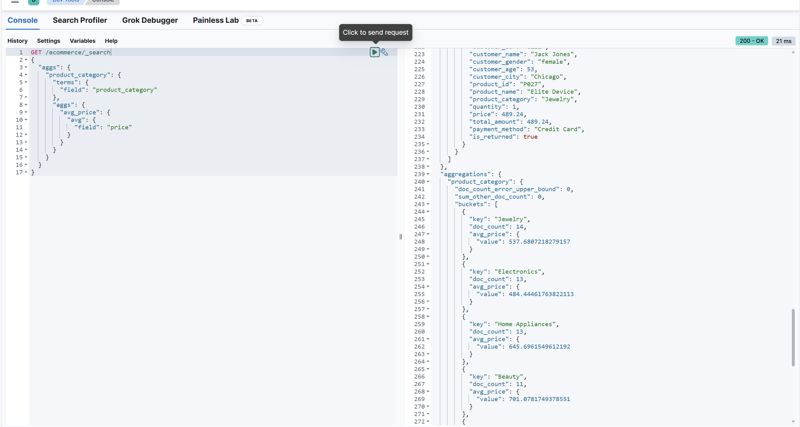
### 2.10找出订单数量最多的前5个城市。
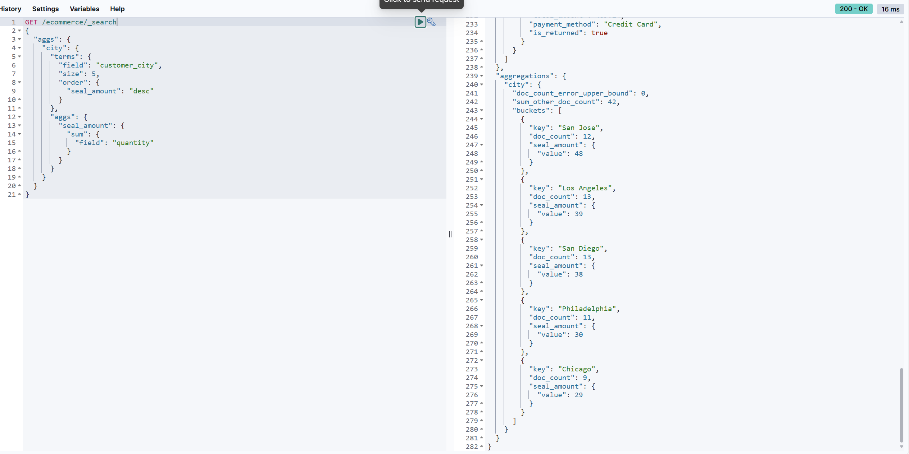
### 2.11计算每个季度的平均订单金额。
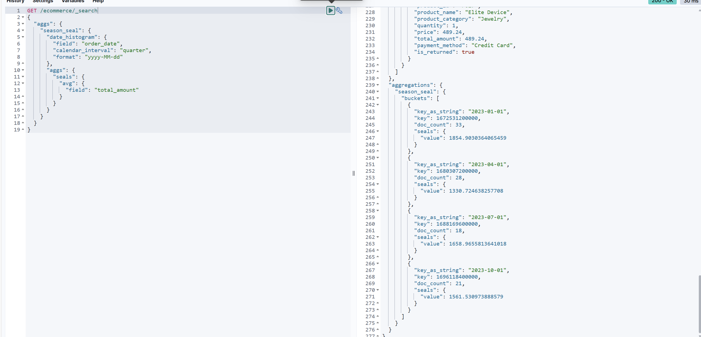
### 2.12统计每个产品类别中的商品数量。
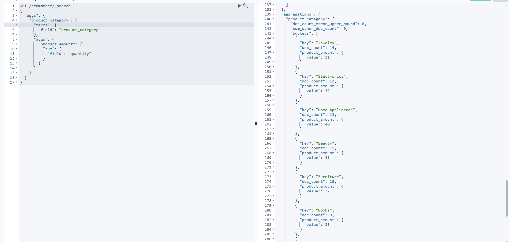
### 2.13计算男性和女性客户的平均订单金额。
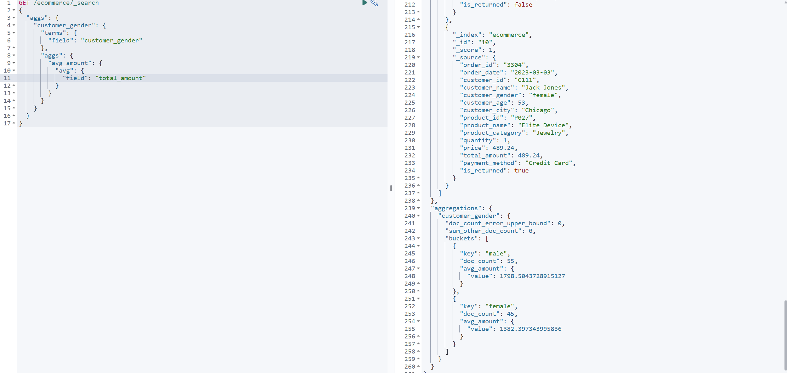
### 2.14找出总销售额最高的前10个日期。
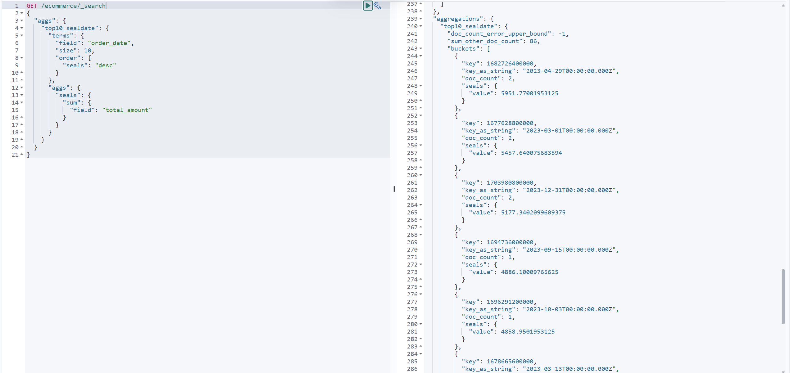
### 2.15计算每个季度销售额最高的产品类别。
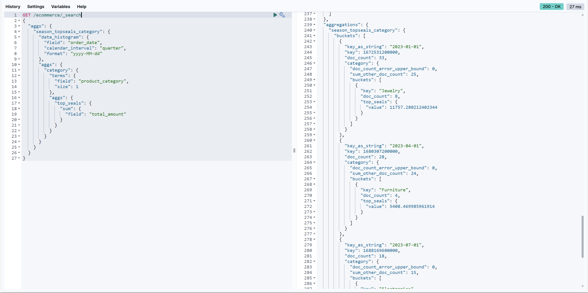
### 2.16计算每天的订单数量,并显示7天移动平均值。
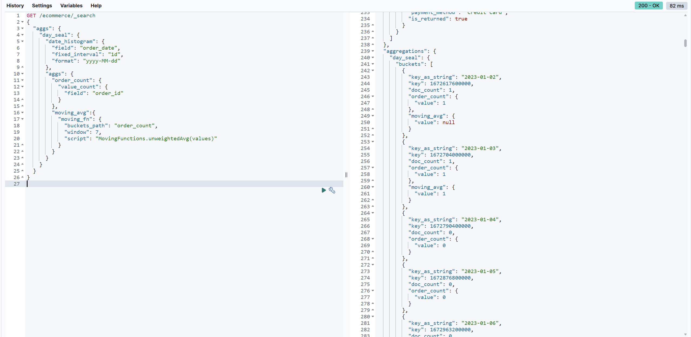
### 2.17比较本月销售额与上月销售额的差异。
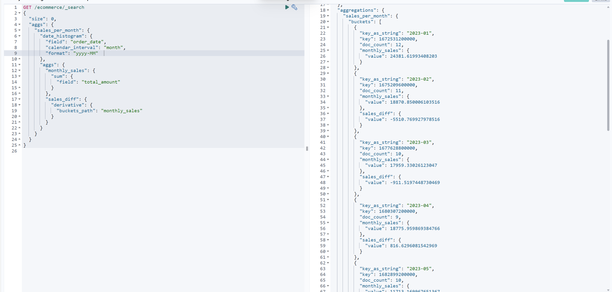
### 2.18计算每周的总销售额，并找出销售额增长最快的一周。
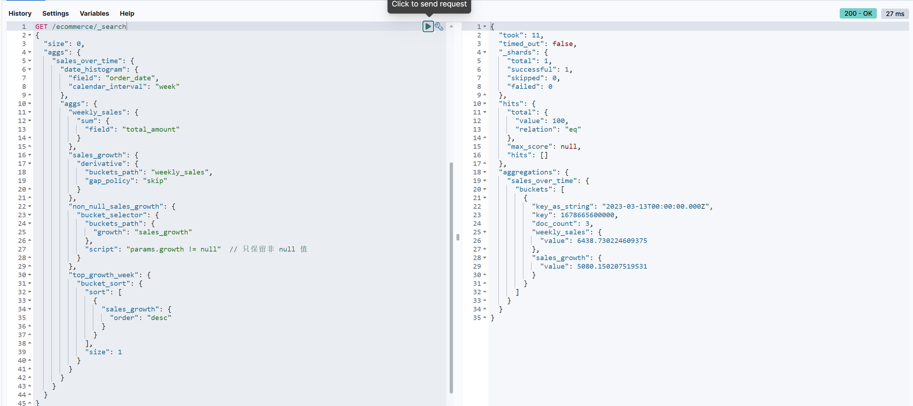

## 3、问题及解决方法
* 问题  
    暂无
* 解决方法  