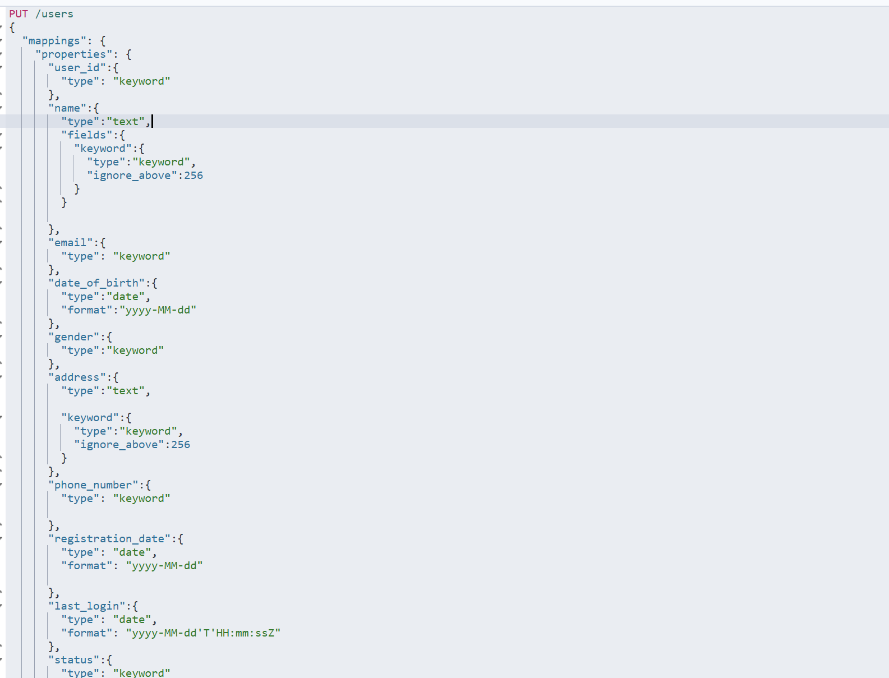
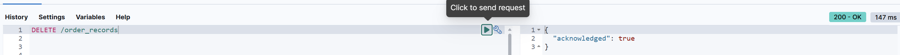
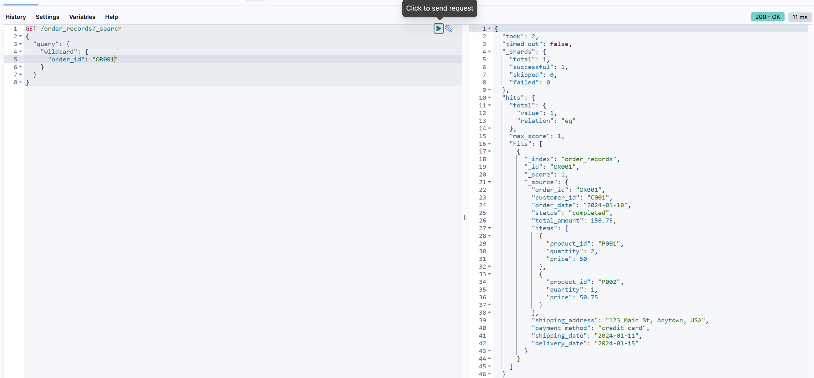

# 实验二：索引操作与操作文档的练习
**学院**：省级示范性学院    
**题目**：《实验二：索引操作与文档操作练习》  
**姓名**：黄东鑫    
**学号**：2200770045    
**班级**：软工2201  
**日期**：  
**实验环境**：Elasticsearch8.12.2 Kibana8.12.2

## 1、实验目的
1. 掌握Elasticsearch 安装IK分词器安装方法
1. 掌握Elasticsearch 索引操作方法
1. 掌握Elasticsearch 文档操作训练
1. 掌握Elasticsearch 高级查询与DSL训练

## 2、实验内容
1. **Ik分词器安装**

1. **索引操作的练习**   
要求：能够根据字段描述，创建索引，修改索引，删除索引
任务一：
    1.  创建索引
    1.  修改索引（自己设计，修改要合理）
    3.  删除索引
    4.  查看所有

    *******

    **用户信息 (User Information) 索引**    
    1. 创建索引    
    
    1. 修改索引
    
    1. 删除索引
    
    1. 查看索引
    

   
    *************

    **产品目录 (Product Catalog) 索引**     
    1. 创建索引
    
    1. 修改索引
    
    1. 删除索引
    
    1. 查看索引
    

    *****

    **订单记录 (Order Records) 索引字段描述**
    1. 创建索引
    
    1. 修改索引
    
    1. 删除索引
    
    1. 查看索引
    
    
    *****

1. **文档操作练习**     
    要求：文档的CRUD练习
    任务二：
    1.  创建文档
    2. 修改文档(自己设计，修改要合理）
    3. 删除文档
    4. 查看文档
    5. 将下面的Json数据批量导入ES数据库中

    *****
    **用户信息数据**    
    1. 创建文档
    
    1. 修改文档
    
    1. 删除文档
    
    1. 查看文档
    
    1. 数据导入
    
    
    ******

    **产品目录数据**
    1. 创建文档
    
    1. 修改文档
    
    1. 删除文档
    
    1. 查看文档
    
    1. 数据导入
    

    *********

    **订单记录数据**
    1. 创建文档
    
    1. 修改文档
    
    1. 删除文档
    
    1. 查看文档
    
    1. 数据导入
    
    
    *****

1. **高级查询&DSL练习**     
    **用户信息数据**    
    1. 查询所有女性用户的姓名和电子邮件。
    
    2. 查找最后登录日期在2024年9月1日之后的所有活跃用户。
    
    3. 查询住在"Anytown"的用户。
    
    4. 查找出生日期在1990年之后的所有用户。
    
    5. 查询所有状态为"inactive"的用户。
    
    6. 查找注册日期在2023年1月1日到2023年12月31日之间的用户。
    
    7. 查询名字为"Bob Smith"的用户的详细信息。
    
    8. 查找电话号码以"123"开头的用户。
    
    9. 查询电子邮件域为"example.com"的所有用户。
    
    10. 查找所有名字中包含"Lee"的用户。
    

    ********

    **产品目录数据**    
    1. 查询所有类别为"Audio"的产品名称和价格。
    
    2. 查找价格高于50美元的所有产品。
    
    3. 查询库存数量少于100的产品。
    
    4. 查找评分高于4.5的所有产品。
    
    5. 查询标签中包含"smart"的所有产品。
    
    6. 查找供应商为"TechCorp"的产品。
    
    7. 查询发布日期在2023年6月1日之后的所有产品。
    
    8. 查找描述中包含"wireless"的产品。
    
    9. 查询价格在20美元到100美元之间的所有产品。
    
    10. 查找产品名称中包含"Light"的所有产品。
    
    
    ******

    **订单记录数据**
    1. 查询所有状态为"completed"的订单的订单ID和总金额。
    
    2. 查找总金额大于100美元的所有订单。
    
    3. 查询支付方式为"paypal"的订单。
    
    4. 查找订单日期在2024年2月之后的所有订单。
    
    5. 查询包含产品ID为"P001"的订单。
    
    6. 查找所有状态为"cancelled"的订单的客户ID。
    
    7. 查询发货日期在2024年1月15日之前的订单。
    
    8. 查找使用"credit_card"支付的订单。
    
    9. 查询总金额在50美元到200美元之间的所有订单。
    
    10. 查找订单ID中包含"OR01"的所有订单。
    
## 3、问题及解决方法
* 问题  
    * 对索引与具体文档的联系不清楚
    * 对一些具体的jsonKey作用不清楚如nested
* 解决方法  
    * 对文档进行一些操作后解决了第一个问题
    * 问Ai后，对一些实列练习解决